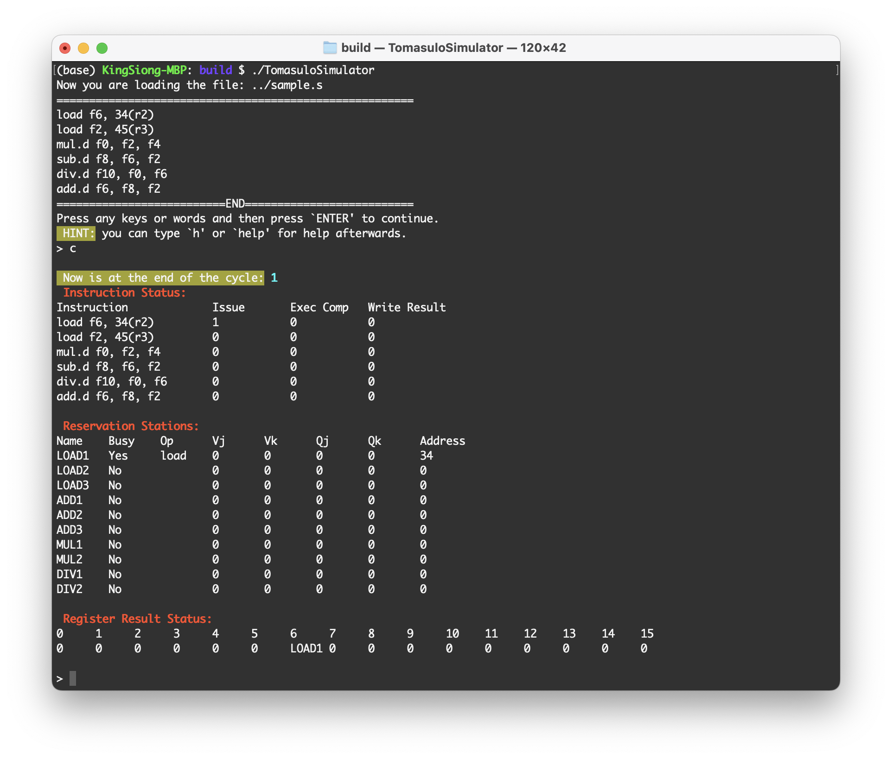

This project is my another computer architecture assignment in XJTU: to implement a dynamic dispatch simulator using Tomasulo algorithm.

To run this project, do these following:

```bash
$ cd src/build/ # if there is no ``src/build/'', mkdir build/ and do this again
$ cmake ..
$ make
$ ./TomasuloSimulator
```

After these, you are now running with the file `src/sample.s` by default. If you'd like to run with your own assembly code `assembly.s`, just move it to `src/` and do as following:

```bash
$ ./TomasuloSimulator ../assembly.s
```



And again, this is another weak simulator cause there are few instructions... hhhh... Wish I could improve it again.

others: there may be something with the answer of efficiency calculation cause i was a little bewildered here when use tomasulo algorithm. I calc this by divid speedup by 3 cause there are 3 parts of a pipeline but i think this is not true. 

Have fun. :)
